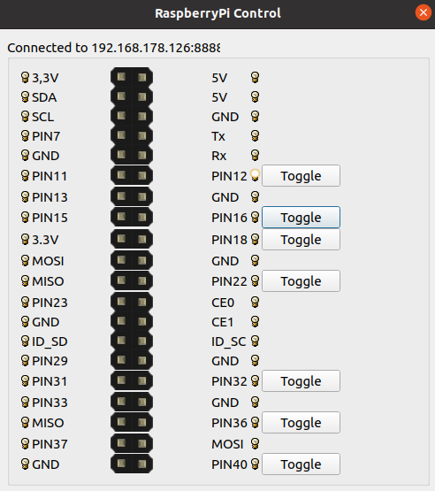

# Bloggy

GUI application for controlling pins on RaspberryPi.

### **How to start application**

Application requires python 3.4+ to be successfully started.

#### Server startup
> 1) Go into `app` folder
> 2) `python server.py`

#### Client startup
> 1) Go into `app` folder
> 2) Install requirements from requirements.txt file
> 3) `python client.py`

#### Configuration
Server IP and PORT, list of pins to control for client application can be set in `app/settings.py` file.
